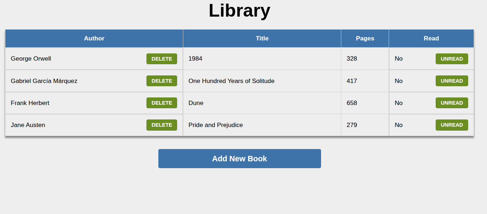

# library-app

This project is part of **The Odin Project: JavaScript** curriculum.

The goal of this project was to build a small Library application using JavaScript, while practicing **objects, constructors, prototypes, DOM manipulation, event handling, arrays, and data attributes.**

## Features

- Add new books to the library
- Display books in a table
- Store books as JavaScript objects in an array
- Generate a unique ID for each book using crypto.randomUUID()
- Delete books from the library
- Toggle a book's read status
- Use a <dialog> element for the "Add New Book" form 
- Validate required form fields
- Dynamically create book elements using JavaScript
- Associate DOM elements with book objects using data-* attributes
- Use event delegation to handle dynamically created buttons

## Technologies Used

- HTML5
- CSS3
- JavaScripts (ES6+)
- DOM API

## What I Practiced

### JavaScript

- Constructor functions
- new and new.target
- Object properties
- Prototypes and prototype methods
- Arrays
- find()
- findIndex()
- splice()
- Template literals
- Ternary operators
- Event listeners
- Event delegation
- dataset
- createElement()
- textContent
- append() / appendChild()
- crypto.randomUUID()

### HTML

- Semantic table structure
- Forms
- Form validation
- <dialog>
- data-* attributes

### CSS

- Table styling
- Flexbox
- Buttons and hover states
- Form layout
- Dialog styling
- Backdrop styling
- Responsive sizing

## How It Works

Each book is represented by a book object:

```function Book(author, title, pages) {
    this.id = crypto.randomUUID();
    this.author = author;
    this.title = title;
    this.pages = pages;
    this.read = false;
  }```

Books are stored in the myLibrary array:

`const myLibrary = [];`

A separate function creates a book and adds it to the array:

```function addBookToLibrary(author, title, pages) {
    const book = new Book(author, title, pages);
    myLibrary.push(book);
  }```

The read status is changed using prototype method:

```Book.prototype.toggleRead = function() {
    this.read = !this.read;
  };```

The DOM is generated from the data stored in the library. Each table row receives the corresponding book's unique ID through a data-* attribute:

`<tr data-book-id="...">`

This allows the application to identify the correct book when the user clicks **DELETE** or changes the read status.

## Project Structure

library/
|-- index.html
|-- library-app-screenshot.png
|-- README.md
|-- script.js
|-- style.css

## Screenshots



## Live Demo 
[Live Demo](https://aliousang.github.io/library-app/)

## Project

This project was completed as part of **The Odin Project-JavaScript Curriculum**.

[The Odin Project](https://www.theodinproject.com/)
